# learn_technical_management
```text
原文地址：https://time.geekbang.org/column/intro/113

个人声明：
优秀的人帮我们总结了精华，而我之所以会写下来，一方面能加深我对知识的理解，另一方面也能够让我散发性思维思考。
此文不会用于商业用途，只是用于自我知识的积累。
```

## 1.多年前的那些工程师都去哪了？
1.工程师10年职业发展状况  
工程师职业发展大体分为四大类：**技术类**、**管理类**、**创业类**、**顾问类**
* 技术类  
  技术类主要包含两大方向：
  * 一个方向是侧重于“广”，着眼于技术的整体性、架构性和业务解决方案，我们称为 架构师 或 首席架构师。
  * 一个方向是侧重于“专”，着眼于某个专项技术的深度、专业度和精细度，我们称为 某领域专家 或 科学家。
* 管理类
  管理类也包含两大方向：
  * 技术管理者，从工程师到技术团队的一线经理，在慢慢做到部门经理等二线经理，然后就是技术副总裁，终极目标CTO。
  * 职业经理人，不限于负责技术类团队，往往负责的是一个完整的业务，很像这个业务的CEO，称为GM。
* 创业类  
  创业类也有两个方向：  
  * 一个方向是作为创始人牵头创业，做领头羊。
  * 一个方向是作为技术合伙人或技术高管全盘负责公司技术，以技术管理为公司“安邦定国”。 
  
  技术合伙人方向 和 技术管理者方向 有什么区别？看上去都是 技术高管。  
  区别主要是，你是从公司早期就共同创业做到高管的，还是你只在一家比较成熟的工作做高管，这是两种不同的路。
  前者的核心是共同创业，他们大部分时间不是技术高管，而是共同创业者；后者，他们大部分时间在做技术管理，工作方式、方法和创业公司差别很大。
* 顾问类  
  顾问类两个方向离的有点远：  
  * 一个是投资顾问，也就是投资人，有做投前的，也有做投后的，基于对一个创业团队和项目的完整判断，从外围
  以资本运作和投后服务来支持创业公司发展。
  * 一个是管理顾问，就是提供培训、咨询服务，偏人力发展和团队建设。这个方向是通过支持管理者和HR来
  支持公司的发展，以多年的管理经验、管理理论、教练技术和培训经验为依托。
  
四大职业分类占比：  
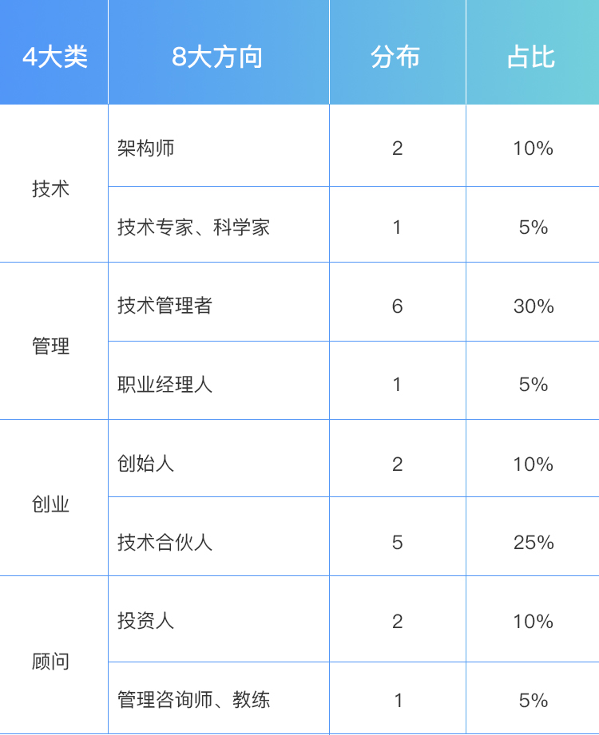  

四大职业技能清单： 
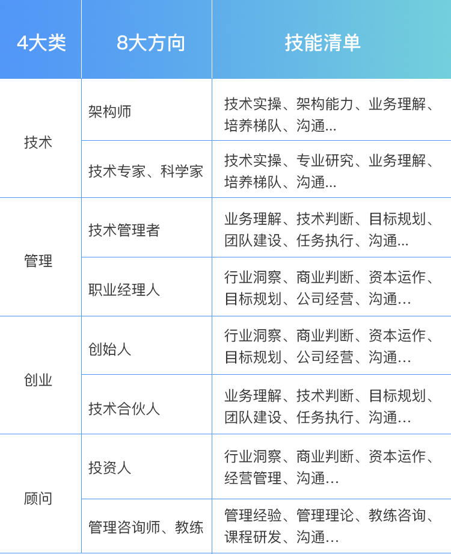  

开始你作为工程师，需要很好的技术实操能力，这是作为工程师的职业素质。慢慢的，随着你能做的事情越来越多、越来越大，
你会提升整体架构能力，成为一名架构师。而如果你对某个专业领域的技术越来越专精，你会成为一名技术或科学家。  
当然，你也可以不断拓展自己项目管理的能力，这样你就会成为越来越高的技术管理者，也可以去创业公司做技术合伙人。
当你越来越关注行业发展、商业逻辑、公司经营，就慢慢拥有了职业经理人和公司创始人的视角；
当你越来越关注资本运作和资本产生的价值，就会从投资人的角度去看待各行各业和整个社会。

总之，对于技术人员来说，无论你是否做技术管理岗位，你所有的职业发展，都会围绕着技术和管理这两条腿在走路，一条腿是走不远的。


## 2.我要不要做管理呢？内心好纠结！
在做了几年技术之后，大部分技术人会把“做管理”作为一个重要选选项来考虑，甚至在很多时候，你的上级会推着你带团队。

做管理，对你意味着什么？
常见有四种回答：
* 第一类：不得已的选择。
* 第二类：别人眼里的成功。
* 第三类：不负组织的期待。
* 第四类：对管理的主观遐想。
以上四种都属于“外驱力”范畴，如果时间一长，你就会觉得管理工作越来越烦人，并不是自己期望的那样风光，甚至怀疑自己选错了路。

你应该考虑一下你自己的内在动力和真正诉求了。通过三个重要问题，来进行判断：
第一个问题，是关于“管理价值观”的，即，你是否认同管理的价值？  
不认同管理价值的主要表现在：  
* 认为招聘面试、辅导员工、向上级汇报、开会沟通、流程梳理、资源协调、进度推动、绩效评估等都是琐碎杂事，因占用时间而不满。
* 认为经理是给高工程师和架构师打下手的，职责就是支持好架构师的工作。
* 认为管理的工作不如技术工作有价值。

第二个问题，你是否对管理充满热情，并享受这些工作？  
比如：  
* 你是否主动地向自己上级了解过团队的工作目标？
* 你是否主动关心过新同时该怎么培养，以及帮助他们成长？
* 你是否享受去负责一个大项目的协调和推进？它的成功是否给你带来强烈的成功感？
* 你是否思考过什么样的流程和机制可以应对团队工作中的那些疏漏？

第三个问题，你是否看重在管理方面的成长？由于之前没有太多管理方面的学习和积累，意味着你有更好的可塑性，同时也意味着需要学习更多的知识。


做管理扩充的认知和能力很多，比如：  
1.更大的责任。  
2.更立体的视角。  
3.更灵活的思维方式。  

任何事务都有其两面性，上述的挑战和要求给你带来成长和收货：  
1.你得到一个更大的平台，你的能力和视角得到大幅提升。给你带来成长感。  
2.你不但能力变强了，你还有了团队，你能搞定更大、更复杂的事情，做出更大的成绩。带来成就感。  
3.你带着团队做出越来越多的成就，团队也就越来越优秀，团队成员得到成长，你甚至还会影响到团队。影响力提升。  
4.你的能力、成绩、影响力全面提升，你得到了更多的精神和物质回报。  

结束语：  
**服从让我们撑过白天，而投入让我们撑过夜晚。**  
这告诉我们一个简单的事实：*外驱让我们可以做好本职工作，而内驱才能让我们成就卓越。*


## 3.哪些人比较容易走上管理岗位？
你或许早就决定做一名管理者，你是否和你的上级交流过这个问题？对于做管理来说，个人的意愿很重要。
一个有意思的情况是，最顺利走上管理岗位的，却不一定是有这些诉求最明确、准备最超前、表白最早的20%。
而是扯上“天时、地利、人和”。

1.“天时”  
做管理的“天时”，其实就是机会、时机、大环境、时代背景。  

毕业的时候你选择了什么样的行业和企业，就决定了什么样的机会和可能。如果你要做管理，最好选择那些发展快的行业和公司，这意味着更多的机会。
当然，机会更多意味着更多的挑战，如果你希望工作得舒服轻松一些，依然可以去稳定的行业和企业工作，但在稳定的行业要走上管理岗位，可能需要漫长的等待。

是不是变化越快就月适合做管理呢？也不是绝对的，去创业公司，机会是多，也很能锻炼能力，但像天使轮，A轮这样的创业公司，大多处于生存期，还没有上规模，
而没有规模的公司并不需要你去做管理，所以很大的概率会失望。而且，管理是需要长期积累的。所以，去能积累经验的公司做管理，会是更好的选择。

一个人走上管理岗位有很多“机缘”，你可以审视一下你自己，你所在的公司和团队可能产生出哪些新的机会。

2.“地利”  
做管理的“地利”，就是你的优势、能力，以及你所负责的工作内容。

所谓优势，都是基于特定的工作内容和工作任务而言的，抛开具体工作场景泛泛而谈优势和能力没有意义。

技术能力对晋升有影响很容易理解，负责如下工作内容的工程师，更容易成为管理者：
* 第一类是负责最全局的模块，核心是“广”。每一个团队业务，都会被分成很多模块，总会有那么几个模块事关全局，也跟大家关联最多的，
比如提供所有的服务接口、做所有的数据组装和呈现、产品功能的实现等等。这样的工作内容，使得负责的工程师很快锻炼出全局的视野、积极的沟通协调能力，
并和很多人建立起合作关系。做得好的话，很快就可以成为一个团队的工作核心。
* 第二类是负责最核心的技术模块，核心是“深”。掌握着团队最核心、最重要、最优技术含量、最能体现团队价值模块的工程师，是团队里的骨干，
不可或缺的核心技术，容易得到上级重视去承担重任。他们往往影响力比较大，所以容易走上管理岗位，不过常常是被动的。如果你主动去了解技术和业务的全局，
并主动争取做一些大型项目的负责人，你就具备了做管理的“地利”，前提是你先认识到这一点。

3.“人和”  
做管理的“人和”，就是你能否得到他人的支持。

那么，要得到哪些人的支持呢？一般来说，你需要四类支持：
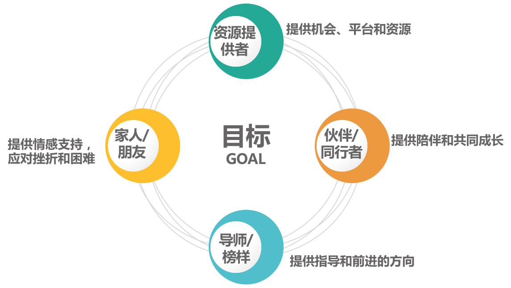  
* 第一类，为你提供机会、平台和资源的支持。一般是你的上级，他们是否支持你做管理非常重要。
* 第二类，为你提供陪伴和工程成长的支持。一般是和你平级的管理者，尤其是那些你愿意与之持续交流、切磋管理问题的伙伴。
* 第三类，为你提供指导和前进的方向。一般是你的导师、指导人、管理教练或上级。你可以设定你认可的管理榜样，多和他交流，多听听他的看法和意见，这会让你的管理之路顺畅很多。
* 第四类，为你提供情感支持，让你勇于面对困难和挫折，在管理之路上走得更远。一般来说，你的家人和朋友，可以担当这样角色。
盘点以上四类人，并寻求他们的支持，尤其是稳定的支持，就构成了你做管理的“支持系统”，满足了你的“人和”。


当你具备了“天时、地利、人和”，你自然可以更顺利的走上管理岗位。但你有可能会问“天时、地利、人和”我都不具备，我是不是就不能做管理了？
淡定，我们讨论的是什么样的人更容易走上管理岗位，而没说不具备这些条件就做不了管理。
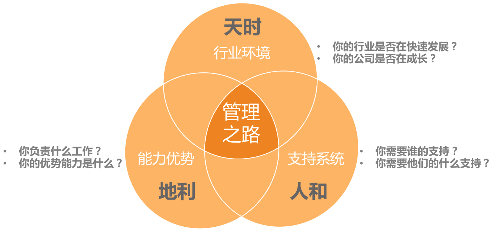  

想被提拔为一个管理者最好的方式，就是你首先成为一个实际的管理者，我们常常把这样的晋升理念叫“既定事实”，而这种理念在互联网行业里被广泛认同。

**创造地利，争取人和，等待天时**

## 4.我要不要转回去做技术呢？
经历从工程师到团队Leader这个转变，大部分人的感受：
* 管理的事儿太杂，都没时间写代码了，越来越心虚....
* 做管理最大的挑战是，要舍弃技术，特别难。
* 管理和技术该怎么平衡？
* 突然不写代码了，感觉吃饭的家伙没了。
* 管理工作太琐碎，感觉离技术越来越远，担心个人发展。
* 管理是一个有违人性的事情，自己的技术专业性越来越差，但是却要带领整个团队。

如果你恰巧正在经历这个阶段，你对于个人角色的转变最大的感受是什么？你又如何看待技术和管理间的“冲突”呢？
然而，“两者兼顾”并不能真正解决问题，要想解决这些问题，我们得首先来看看问题的真正根源是什么，然后对症下药。

想想上面大部分人的感受，他们大致可以归类以下三种情况：
1. 转管理前没有仔细了解过管理。技术人员，常常会沉浸在代码或者技术细节中，在职业发展方向思考上，整体偏被动。
他们往往是被领导推到管理岗位上去，而在此之前对怎么做管理并没有深入的了解。在全新事务面前，因为无法掌控而感到或恐慌，
或者焦虑就在所难免了，时不时就会冒出一个念头：万一做不好怎么办？退路在哪里？
2. 才开始做管理，还无法靠管理“安身立命”。至少在他们心中，管理能力并不能让自己安心，更不能让自己依靠，
就好像还没有完全驯服的野马，还不确信能骑好，想来这也是人之常情。
3. 认为技术才是自己的大本营。由于技术作为自己依存资本，过去工作中已经得到了很好的证明，因此非常值得信赖。

以上三个共同点归结到一起，恰好如实反映了新经理此时的状态：“患得”、“患失”，这里只能说明是一种纠结的心情。
他们对于做管理，还没有摸到门道，不知道该怎么搞定，经常出现一些让自己不知所措的状况，倍感焦虑；而之前已经熟练掌握的技术能力，
因为在上面花费的时间越来越少，感觉正离自己而去，怎么不令人烦恼。

既然我们知道了“病根”，那么怎么才能对症下药呢？这里有三个药方可以缓解烦恼：
* 第一个药方，专门针对“患失”来开。  
做技术管理，你并没有放弃技术，而且也不能放弃技术，放弃了技术是做不好技术管理的，你只是在一定程度上，放弃了编码而已。  
没时间编码，怎么才能做到不放弃技术呢？  
首先，把技术提到更高视角来看待。做技术的时候，把技术做好就是最大的目标，
但做管理之后，你会把技术作为一个手段来看待，看它究竟能为目标带来什么。但这并不意味着你就不在关心技术，只是关心的层次不同了，
你需要借助每个人的技术能力去做更大的事情。  
其次，换一种学习方式来掌握技术。亲自写代码固然是很好的学习技术的方式，
但是作为leader，你需要快速掌握更多的技术，并且快速判断该如何搭配使用，所以你一定得有更高效的学习方式才行。  
这里有三个有效的学习方式推荐给你：  
方式一：建立你的学习机制。你想想在团队中建立什么样的学习机制，可以帮助团队的力量来提升技术判断力，并结合自己的情况来创建。  
方式二：请教专家。在了解某个领域的情况时，借助你的平台，找你能找到的最厉害的专家高手进行请教。  
方式三：共创。在这个知识型工作者的时代，和自己埋头思考相比，共创成果往往会出乎你想象，特别是增长见识。

* 第二个药方，专门针对“患得”来开。  
这里的“患得”其实是患“不得”。  
首先，做管理对个人成长和发展来说，不会失败。因为管理总体上是一项修炼，只要你持续不断的实践、练习，你的造诣就会越来越高，
最后你一定可以胜任某个规模或某个职能的团队。  
其次，一线技术管理者，即使“做不好”也并非没有“回头路”。  
最后，做管理所积累的能力，完全可以做到“技术带头人”或“技术leader”这个角色上。你不用担心管理的工作会白做，把本来做技术的时间耽误了。
因为，即便你再回头去做工程师，也需要练习去做高级工程师或架构师，需要尝试去负责一个完整的技术方向，此时，你做管理时锻炼的全局视野、
规划能力、结果导向意识、项目管理方法、沟通协调能力等等，都会派上用场。

* 第三个药方，叫作“认清现实”。  
无论你做不做管理，都需要更高的视角去看待技术。  
即便不做技术管理者，要做好一位技术带头人或架构师，工作视角也要做如下升级：  
首先，从目标出发去看待技术。只有目标明确，才能选择最佳的技术方案，做出最好的技术决策。  
其次，从评估的角度去看待技术。做工程师的时候，把一个技术方案设计好，实现出来就好了；做了架构师之后，你需要非常清楚一个技术方案
是通过哪些维度来评估其好坏优劣的。并且，当一个技术问题暴露出来后，得迅速判断会造成什么影响，损失的边界在哪里，
有多紧急，以决定要不要放下手上的项目去立一个紧急项目。  
最后，从借助自己的技术到借助大家的技术。做技术的时候，了解自己能做什么就好了。但是无论是做管理者还是架构师，你都需要带人做事了，
这个时候你就需要熟悉团队里每个人的技术情况，知道谁能胜任做什么事情，适合做什么事，然后借助大家的技术去做事。

上面三个药方就是，既然你避无可避，不如奋力向前。你要做的并不是免除“后顾之忧”，而是需要意识到，你已经没有“后顾”了。
总之，技术转管理的纠结，归根结底是“**对管理的患得和对技术的患失**”。

## 5.作为技术管理者，我如何保持技术判断力？
转型做管理后，你可以用在技术上的时间会越来越少，尤其是写代码的机会越来越少，手越来越生，但是要做的技术评审和技术决策却有增无减，
对技术的判断力的要求反而越来越高。这是因为你的决策产生的影响比之前更大了。

**技术管理者要保持自己的技术判断力！** 可见这个问题大家都看在眼里，但却很少有人告诉我们，技术判断力都包含了哪些内容，也很少有人告诉你该怎么去做。

在管理越来越繁重的情况下，技术管理者应该如何保持自己在技术上的判断力？  
技术管理者和普通管理者的最大区别就是“技术”二字，这也是技术管理者最鲜明的标签和最大的竞争力，它如此重要，但又令人不知所措。

从技术工程师到技术管理者转型，有很多做事的思路和方法都需要转变。其中一个重要的转变就是你和技术的关系，也就是说技术对你来说意味着什么。
当你还是一位工程师的时，你是技术的操作者和实现者，所有的技术服务都从你的手中诞生；而在成为一个越来越成熟的工程师的过程中，
你越来越少地去实操，慢慢变成了技术的应用者，你需要的是把这些技术服务装配成更大的服务和产品。
由此可见，当工作角色从一个技术实现者变为一个技术应用者时，你和技术的关系就发生了变化。


从技术实现者到技术应用者，具体发生了哪些转变呢？  
* 对于技术实现者来说，程序设计能力、编码实现能力、技术攻坚能力和技术评估能力，都是需要具备的，主要关心的是“怎么做”，属于“how”范畴。
* 对于技术应用者来说，技术评估能力变得尤为重要，以为内技术管理者主要关心的是“要不要做”，“做什么”，属于“why”和“what”的范畴。
在综合评估之后，做出决策和判断。所以，需要我们持续保持“技术判断力”，而并非“保持编码能力”。


那么该如何保持技术判断力呢？  
因为所有判断，都先要评估，所以技术判断力，其实就是指对技术的评估能力。评估的维度主要分三个方面：  
* 第一个维度是结果评估。即，你要回答“要不要做”，希望拿到什么结果，你要从哪几个维度去衡量结果，从哪几个技术指标去验收成果。
无论如何，你心里都需要很清楚，用什么技术指标来衡量团队的某项技术工作，而不只是完成一个个项目。事关每项工作的效果和业绩，对结果的评估能力最为关键。
* 第二个维度是可行性评估。可行性评估有两层含义：一是“能不能做”；二是“值不值得做”。
不懂技术的管理者一般都问“能不能做”，有经验的技术管理者和资深工程师一般都考虑“值不值得做”。
所谓“值不值得做”，就是成本收益问题。收益，往往是显而易见的；而成本，就又很多方面需要考虑，这正是体现技术判断力的地方。
首先是“人财物时”等资源投入成本，即需要投入多少人力，多少时间，甚至多少资金和物资在该项目上，这项成本相对容易评估。
其次是维护成本，这是评估技术方案时要重点考虑的！一般我们往往只考虑到项目发布；而发布后的维护成本很容易被忽略。  
常见的维护成本主要有四个方面：  
1.技术选型成本。 这是指你在做技术选型的时候，选择不成熟的技术所带来的成本。越成熟的技术，其技术实现成本和人力成本都是相对较低的，
但并不是说，选择新技术就一定不划算，只要考虑到成本和风险，才能做出合理决策。  
2.技术升级成本。这是指在评估技术方案的时候，其兼容性和扩展性水平带来的后期升级难度和成本。  
3.问题排查成本。在做技术实现的时候，要特别关注后续的问题排查。好的技术实现，分分钟可以排查出问题的原因；而不好的技术实现和方案，
查一个问题可能需要花上几天的时间，成本差异不可同日而语。  
4.代码维护成本。在编写代码的时候，要记得代码是要有可读性的。这体现在别人升级代码要花多长时间才能看明白，修改起来是否简单、安全。  
**考虑维护成本是技术管理者和架构师视野宽阔、能力成熟的体现。**    
5.机会成本。这是技术管理者做决策时要意识到的。即，当你把人力、时间花在这件事上，同时就等于放弃了另外一件事，而没有做另外这件事将带来什么影响？
就是你要考虑的机会成本，你可能会因为这个思考而调整技术方案的选择。  
6.协作成本。即，多人协作所增加的时间精力开销。一个方案的协作方越多，需要沟通协调的成本也就越高，可控度越低。
如果可能的话，尽量减少不同团队和人员之间的耦合，这样会大大降低协作成本。
* 第三个维度是风险评估。风险评估，也叫技术风险判断力。即，有哪些技术风险需要未雨绸缪，考虑该技术方案带来最大损失的可能性和边界，
以及在什么情形下会发生。这项评估工作很考验技术管理者的技术经验和风险意识，而且需要借助全团队的技术力量来做出准确判断。  

对于一个技术方案或一项技术决策，如果你能从上面三个维度去评估，就说明你拥有了很好的技术意识和判断力；另外，你还会发现，
如果能做好技术评估工作，你的技术能力并不会降低，还会持续提高。


那么该如何提升技术判断力呢？  
判断力不是天生的，也不是一蹴而就的。新经理的技术判断力，基本上都来自于之前技术的实际操作，来自于自己的经验积累。
而做管理之后，技术评估方面的要求更高了，研究技术的时间和精力却减少了，这该怎么破？
别忘了，自从你带团队的那一天起，你就不是一个人在战斗。所以，你可以依靠团队和更广的人脉，去拓展技术视野和技术判断力。

常见的几种方式提升技术判断力：  
* 建立技术学习机制。盘点你负责的业务，需要哪些方面的技术，成立一个或几个核心的技术小组，让团队对各个方向的技术保持敏感，
要求小组定期做交流和分享，这样你就可以保持技术的敏感度。
* 专项技术调研项目化。如果某项技术对团队的业务有重要的价值，可以专门立项做技术调研，并要求项目负责人做调研汇报。
* 和技术大牛交流。越是技术厉害的人，越能深入浅出的把技术讲明白，所以针对技术找大牛取经，也是学习的好途径。
虽然实际操作的时间少了，但你和技术大牛的交流机会多了，一方面因为你有更大的影响力了，另一方面，你和技术大牛有了共同的诉求，
就是把技术“变现”，让技术产生价值。
* 听取工作汇报。因为你带的是技术团队，大部分工作都和技术相关，在读员工的周报、季报时，相互探讨，也是一种切磋和学习。

总之，你会发现，技术管理人的技术水准的提升和保持，主要看能从周围的身上摄取到多少信息和知识，而不是只靠自学。

归根结底，从技术实现者到技术应用者的转变，不断提升的是技术的使用能力，而技术实现能力由于投入的时间越来越少，会逐渐减弱。
如果说带团队做项目就像组装一部手机，你会越来越清楚如何把各个组件集成起来，但是你不见得清楚每个电子元器件内的技术实现。

既然你选择了做更大的事情，就不得不适当放弃一些细节，放弃一些技术实现能力，不断提升你的技术判断力，让团队行走在正确的方向上。


## 6.我这样的风格能做管理吗？
模仿，是人们学习新技能非常重要和常用的方式。当你尝试做管理的时候，也可能在不断的模仿那些你认为“最优秀”的管理者，并希望像他们一样“成功”。
榜样给力你前进的方向、动力和信心，这对你的成长有积极影响。但不经意间，榜样同时也左右了你的认知，所以需要提醒自己一个问题：
**别让榜样限制住你对优秀管理的想象，以及别把领导力的风格和领导力的高低划上等号。**

领导力风格的差异并不能妨碍你成为一个优秀的管理者。那么到底什么是领导力风格呢？而你自己又最适合哪种风格呢？  

关于领导力风格，也叫管理风格，**本质上就是你和团队的协作方式，也就是你和团队的“位置关系”，即你站在团队什么位置。**
你可以把带团队，看作是驾驭的一辆马车，你和这几匹马是如何协作，一起把马车拉到目的地的。  

其位置关系大体分为四类:
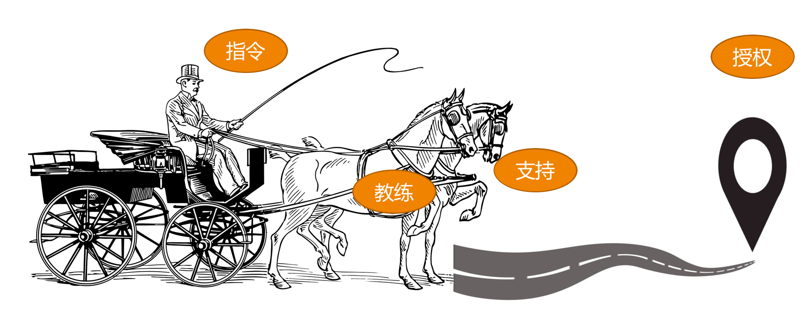

* 第一类是发号施令型。
管理者和团队的关系是：管理者发号施令，全程指挥，但不会亲力亲为去操作，团队成员只要按管理者说的做好执行，不需要问为什么。
就好像一位坐在马车上驾驶车辆的车夫，他不参与拉车，但是马匹的一举一动，都听命于他的指挥。
所以，我们常常把这种管理风格叫作指令管理、命令式管理，或者指导式管理。  
这样的管理者带给团队的往往是很强的控制气场和压迫感，没有人情味，让人有距离感，最符合大众眼中的“领导”形象。
这类管理者往往重事不重人，眼睛盯着目标和结果，对人的发展和成长关注较少。所以，团队执行力很强，但梯队很难培养起来。

* 第二类是以身作则型。
以身作则管理者凡事冲在最前面，是站在马匹中间，和大家一起奋力拉车的人。
这类管理者非常享受和团队打成一片，很像一位身先士卒的将军，战斗力很强，很受团队爱戴，所以往往团队凝聚力很强。  
他们非常在意团队成员的想法和感受，并愿意提供帮助和支持，分担他们的工作和困难，因此我们称之为支持式管理。
对于这类管理者来说，重人不重事，不过他们并不会忽视做事 ，只是不太去指导员工做事，而是倾向于替代员工做事。
这类管理者更像一个带头大哥，员工特别有归属感，但是这类管理者带不了大的团队。

* 第三类是激发辅导型。
这类管理者不会亲力亲为的去帮员工做事，但是会去辅导和启发员工怎么去完成工作，并且提供鼓励、支持和反馈。
换句话说，他们不会替马拉车，但是会陪着马一起赶路，同时辅导马匹怎么样才能把路走好，以及要往哪里走。  
这类管理风格称为教练式管理。即关系员工在做事的过程中有没有得到锻炼和成长，也关心事情本身有没有很好的完成，
整体的步调和节奏如何，以及最后结果的好坏，属于重事也重人。  
在这类管理团队做事，个人成长是最显著的，团队梯队也能快速完成起来。但是由于这类风格对于管理者精力消耗比较大，
很难覆盖到全体成员，所以比较适用于核心梯队培养。

* 第四类是无为而治型。
无为而治，似乎是很多管理者向往的境界，很多高级管理者都向往的境界，很多高级管理者都认为好的管理者应该“没有我的时候，团队完全能自动运转”。  
这类管理者对团队成员做事表现非常放心，甚至让大家感觉有点漠不关心；对任务执行过程不关心，关心的只是他最在乎的目标和结果。  
在这类管理团队中做事，对于不熟悉的团队，成员就会变长野蛮生长；而对于成熟团队，成员就会有很好的发挥空间和舞台，反而会得心应手。

综上所述的四类领导力风格，简单概括如下：
* 指令式管理：重事不重人，关注目标和结果，喜欢发号施令但不亲力亲为。
* 支持式管理：重人不重事，希望带头冲锋亲力亲为，特别在意团队成员感受，并替他们分担工作。
* 教练式管理：重人也重事，关注全局和方向，并在做事上给予教练式辅导和启发。
* 授权式管理：不重人也不重事，关注目标和结果，不关心过程和人员发展。

到底哪种风格比较好呢？  
既然是风格，就是手段层面的东西，评价手段我们往往是用有效无效来衡量，而不会用好坏来衡量，所以，这四类风格无所谓好坏。
一个成熟的管理者应该对这四类风格都能有很好的了解和认知，甚至能驾驭。

简单举例：
* 当一项工作不容闪失，而你又是唯一熟悉、且最优掌控力的人时，一个命令式的你可能更能降低风险、达成目标。
* 当一个团队特别需要凝聚力和斗志，需要攻坚的时候，一个支持的你会促成很好的效果。
* 当一些核心人才需要重点培养，团队需要发展梯队时，一个教练式的你会带来明显的效果。
* 当团队梯队很成熟，团队成员需要发挥空间的时候，一个授权式的你能提供恰当的管理方式。

既然管理风格的本质就是你和团队的协作方式，是手段层面的东西，那么，不同的风格并不会妨碍你成为优秀的管理者。


## 7.我能做好管理吗，大家服我吗？
在新经理的常见困惑中，"不自信"是普遍存在的一个情况。新经理不自信，主要来源有以下几点：
* 第一，管理经验不足或能力欠缺。
对于很多管理事务不知道该怎么着手，在摸索前行中磕磕绊绊，于是怀疑自己没有能力做好管理。
* 第二，和团队成员比较。
由于资历或能力不是团队里面最突出的，担心团队里资历老或能力强的团队成员会不服自己，尤其是这些人提出不同意见的时候，
常常会引起新经理的挫败和颓丧。
* 第三，背负沉重的负担。
因为担心管理工作做不好会辜负上级的期望，所以带着很大的压力去工作。


既然清楚了引发管理自信不足的源头，那么该如何消除这些根源，提升管理自信呢？  

第一类，自信困境：因欠缺管理经验和技能而引起的不自信。  
这是每位管理者必经之路，其实也是学习所有新事物的必经阶段。你可以将以前工作经验中的一些能力迁移到管理上。  
在回答这个问题前，我们先介绍一个能力层次模型：
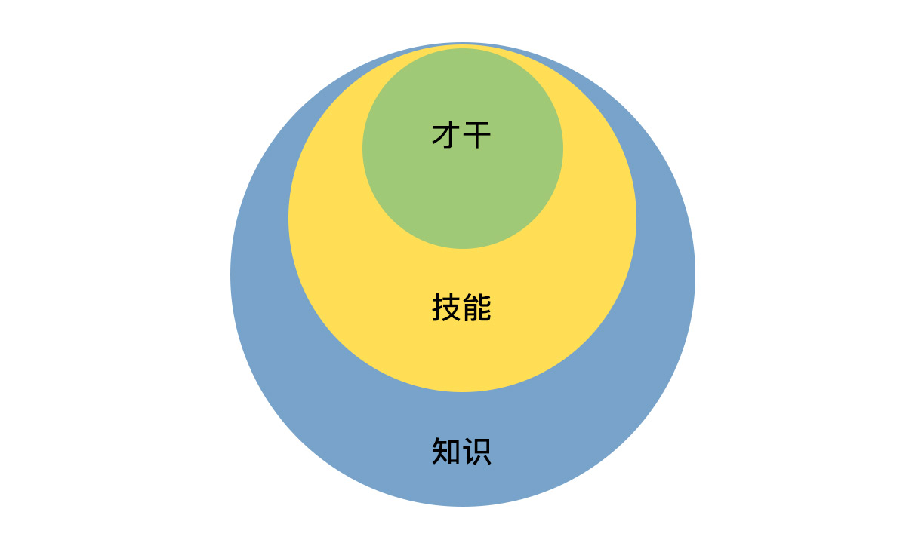
上面模型将能力分为三个层次：知识、技能、才干。  
* 知识，是指你知道和理解内容和信息，一般用深度和广度来衡量。
由于大部分知识都是基于特定工作场景的，所以这部分能力迁移性不好。也就是说你很难把技术知识直接迁移到管理中来。
所以，关于管理的知识，是新经理要重点补习和加强的。
* 技能，是指你能操作和完成的技术，一般用熟练度来衡量。这个层次的能力有一定的可迁移性，比如：
快速的学习能力；进度控制能力等。
* 才干，是你长期生活工作所积淀和锤炼出来的模式、特质和品格。这个层次的"能力"是迁移性最强的。

那你有哪些才干和品质呢？一个常用的方法就是：从你之前的"成绩事件"中去提取，或者从同事朋友对你的赞美中去归纳。


第二类，如何面对团队里的老资格员工和高能力员工。  
如果你团队有不少资历比你老的员工，或者有一些技术能力比你强的员工，那么我得首先恭喜你。
因为这至少说明两个问题：
第一，你真的是非常优秀，以至于你能被公司赏识来负责这样一个团队；
第二，因为这些老资格和高能力员工的存在，你有机会做出更好的业绩。

你可能还会疑惑"他们不听我的，不服我，说什么都是白搭！"。对此，我只想跟你说：
你现在是团队的负责人，需要把自己从和任何团队成员的比较和竞争中抽离，把目光投向远方，去看看你将带出一个什么样的团队，
以及在这个过程中，你能为公司、团队和各位团队成员带来什么样的成绩和成长。

当你不把团队成员放在你的对立面的时候，你和他们就没有任何竞争关系，因为所有的比较和竞争都是在同一个层次上才会发生，
就好像你可能会和你的同学、同事比财富，但是不会和马云去比较。
所以，你要做的，不是和团队成员竞争、比较，也不是比团队每个人都强，而是考虑如何让大家把自己的才智都发挥出来，去达成一个共同的团队目标。
总之，你要做的不是管束和控制大家，而是引导和支持大家。

当你用引导方向和支持帮助的视角去看待你和那些老资格、高能力的员工时，你会因为自己的初心而不再有猜疑和恐惧，
因为只有当你真的能够为团队带来更好发展的时候，才能赢得员工发自内心的真正的信赖。所以，你要做的就是利用大家的力量，
去做出更好的成果，而不是单单因为你的职位让大家服气。一旦你做到了，你也就完成了从工程师到管理者的蜕变，成为真正的leader，自信油然而生。


第三类，因为背负了上级太高的期待而担心做不好。  
如果说前两类自信来源于自我能力和角色认知的提升，那么第三类自信来源于增强外部反馈，尤其是上级。
事实上，自信心的建立的确需要外部的正向反馈，这些正向反馈可以极大的提升你的自我认知度。

建议把反馈通道建立起来，尤其是和上级的沟通通道，可以和上级约好一个例行的沟通机制，定期汇报团队工作，
并就已经完成的一些重要工作征求上级的看法和评价。

这其中，改进建议固然重要，但你还需寻求一些肯定性的反馈，
比如你可以问："在你看来，我有哪一两点是做的还不错的？"，"你能感受到我有明显的进步的地方吗？"，"我希望了解你比较看重什么？""

类似的问题，你也可以和合作伙伴去聊聊，除了他们的意见，不要忘了他们有没有觉得你哪点做的好。

综上，我们总结一下如何提升自信：
* 第一，你可以通过梳理自己可迁移的能力，提升能力自信
* 第二，你可以通过把自己从团队成员的对立面抽，提升角色自信
* 第三，你可以通过收集外部积极正向的反馈，提升自我认同

最后，推荐给大家一句话："**你也许不是那个最强的人，但是你得相信，你是此时此刻做这事最合适的人。**"


## 8.管理到底都做哪些事？
前面第一模块的七篇文章，都是围绕"Why"的问题展开，探讨你是否要做管理，以及如何面对刚刚做管理时的茫然、疑虑与纠结。
如果你已经理顺了内心的力量，希望在管理这条路上大干一场，你还会遇到一个"What"的问题：管理到底做哪些事？

在实际工作中，新经理都是看上级怎么做，就"照葫芦画瓢"跟着学，如果碰到的问题是之前遇到过的，那还好，一般都能应付。
但管理恰恰不是一个靠一成不变的"套路"能做好事情，每一个情境都是具体而崭新的，当面对新问题手足无措的时候，
你可能会殷切的期盼有人告诉你：管理到底包含哪些工作？对于这样的问题到底该从哪里着手呢？

工程师有技术图谱，那么管理有没有管理图谱呢？比如："如何打造高效执行团队？"、"如何群策群力打胜仗？"、"如何做团队建设？"等等。
这类问题的一个共同点就是"大"，虽然大家都可以凭经验给出几点建议，但很难给出系统但回答，因为这些问题本身包含很多子问题。
比如：

第一个问题，如何打造高效执行团队，至少包含三个子问题：  
1. 如何打造团队？
2. 如何让这个团队有高效执行力？
3. 如何定义"高效"？

第二个问题，如何群策群力打胜仗，也至少要回答三个问题：  
1. 如何群策群力？
2. 如何打胜仗？
3. 如何定义打"胜"了？

第三个问题，如何做团队建设，要想回答好，也要先弄清楚：  
1. 在你眼里什么叫团队建设？这个词太范范了
2. 你希望通过团队建设达到什么目的？
3. 如何着手做？

综合问题，你会发现，一个大问题背后依然是多个难以捉摸但大问题，很难理出头绪。而且，随着时代背景的不同，这些问题的答案也差异很大。

比如工业时代的团队和知识经济时代的团队，对于如何提升团队效率，所采取的有效手段甚至是相反的：
工业时代主要靠加强外驱，讲究"胡萝卜大棒"，追求严格管控；
而知识经济时代，更多的是靠激发内驱，弹性工资制也好，发挥员工优势也好，都是希望员工更主动、自主，从而更有创造力。

这也难怪，直到今天也没有人能够给"管理"下一个被普遍认同的定义，因为"管理"这个概念太复杂了的，且随着时代背景、社会环境的改变而不段变化。
不过，这不妨碍我们先了解一下，管理学历史上的几位泰斗人物是怎么理解"管理"的。

* 古典管理理论的代表人物亨利-法约尔认为：**管理是由五项要素组成的一种普遍的人类活动，这五项要素是：计划、组织、指挥、协调和控制。**
由此，可以看出他特别关注管理的过程性，强调"做事"，不愧是"管理过程学派"的创始人。
* "科学管理之父"费雷德里克-泰勒认为，**管理就是确切地知道你要别人干什么，并使他用最好的方法去干。**
他关注的焦点在于**干什么**，以及**怎么干**，有明显的目标性和方法性，强调**目标**和***做事**。
* "现代管理学之父"彼得-德鲁克认为，**管理是一种实践，其本质不在于"知"，而在于"行"；其验证性不在于逻辑，而在与成果。其唯一权威就是成就。**
这个说法的焦点在于实践性和结果性。众所周知，德鲁克是"目标管理理论"的创世人，尤其强调"目标"。
* 当代管理大师斯蒂芬-罗宾斯给管理的定义是，**所谓管理，是指同别人一起，或通过别人使活动完成得更有效过程。**
这个说法蕴含着管理的三个要素：人、过程、有效，用正式一点的词汇叫做：组织性、过程性、目标性，强调了"带人"、"做事"、"目标"。

显然，大师们给了我们一些可以参考的真知灼见，但该怎么实操呢？该如何带人，如何做事，如何规划方向呢？
关于这些"大问题"，是不是无迹可寻了呢？有没有办法一两句话就能说清楚呢？

老子说，"治小国，若烹小鲜"，意思是说，很复杂的事务往往可以用很简单的事情来阐述。
于是，一个常见的说法是把管理比喻成"带兵打仗"；另外，也有人把做管理比喻成教练"指导球队比赛"；还有人认为管理就像指挥家"指挥乐队演奏"，等等。

这些说法听起来都比管理本身要生动易懂。而且，你会发现他们一个共同点，就是都由两个要素组成：
一个要素关于人和组织，像"带兵"、"球队"、"乐队"，简称"带人"；
一个要素是关于事务的，像"打仗"、"指导比赛"、"指挥演奏"，简称"做事"。

如果让我对管理做一个形象而又生动的比喻的话，我更愿意把管理看作是：一位马车夫驾驭着一辆多匹马拉的马车赶往目的地。
这个比喻也体现了前面的两大要素：带人和做事，只不过这里的"人"是一群拉车的马，而"事"就是驾驭马车。


首先，要想驾驭马车，就得先跳上马车；无论你之前是什么角色，跳上马车后，你就成为一名马车夫了。
这就是所谓的"角色认知"。对应到管理就是，从一位工程师到一个团队管理者，也需要对"管理者"这个角色有充分的认知。

其次，在驾驶马车之前，一定要先看看目的地在哪，该走哪条路，朝那个方向进行。
对应到管理中，就是弄清楚团队的工作目标、以及战略选择。我们往往称为"目标管理"，或者"管理规划"，代表着工作的方向性问题。

再次，我们开始驾驭马车，至少需要做两件事情：
一边抓住马缰，关照好马的状态和组织分工；
一边挥舞马鞭，协调好整个马车队的前进方向和节奏，让马匹一起用力把车拉到一个个里程碑和目的地，完成一段一段旅程。
前者对应到管理中，很像是在做人和组织相关的工作，我们称为"带人"，或者叫"团队建设"；
后者对应到管理中，很像是在完成一个个项目或一项任务，我们称为"做事"，或者叫"任务管理"。

最后，由于驾驶马车过程中，马夫需要和马匹，以及马车之外的其他环境要素进行互动和沟通，这对应到管理工作中，就是"管理沟通"。

综上，驾驭马车的五个要素，对应管理工作中，便是：角色认知、管理规划、团队建设、任务管理、管理沟通。

其中，角色认知存在于管理工作的一言一行、一举一动，它无处不在，就好像空气一样，这是做好管理的基础和前提；
而管理沟通贯穿于所有管理工作之中，把所有相关的合作方都连接在一起，就好像水流一样，是做好各项工作的手段和载体。
管理规划、团队建设、任务管理，就是管理者的工作内容了，分别对应着看方向、带人、做事。

我们把无处不子啊的空气般的认知作为"天"，把承载一切管理工作沟通作为"地"，把管理需要做的看方向、带人、做事放在中间，就组成了管理者的管理框架，
由于看上去像一块三明治，我们把它形象称为"管理三明治"。


你可能看到这个框架，还是感觉很"虚"，还是不知道从哪些地方着手去回答文章开头的大问题。
别着急，我们会把"管理三明治"这个框架，细化为一个可以定位大部分管理问题的"管理全景图"，或者叫"管理图谱"。
通过13个要素呈现给你，这样你就可以按图去拆解类似"如何打造高效执行团队？"、"如何群策群力打胜仗？"、"如何做团队建设？"的大问题。
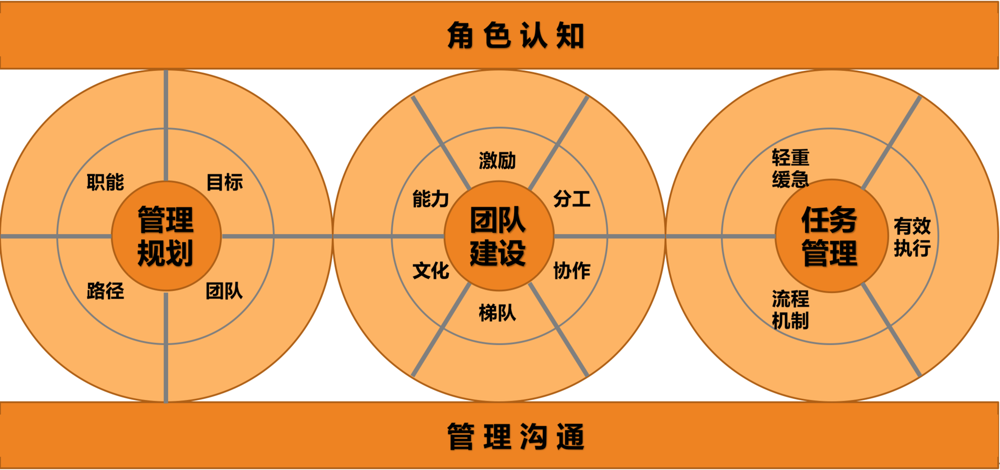


如果你问我，管理都做哪些事呢？我会说："主要做好三件事：带人、做事、看方向，当然做好这些事都要基于良好的角色认知和管理沟通。"


## 9.从工程师到管理者，角色都发生了哪些变化？
我们常常会用"很职业"去形容一个人某项工作做的很棒，意思是说，他很出色的做到了职位所期待和所要求的标准。
那么，一个职业的管理者应该是什么样子的呢？显然，他要符合管理者角色的期待和要求，具体是什么呢？

通过访谈一家著名互联网公司的几十位新经理和他们上级经理，发现一个很有意思的现象：
新经理们希望我能够提供给他们一些工具和方法，让他们应对好日常的管理事务；
而他们的管理上级，则无一例外的认为新经理最需要提升的是管理认知，其中最核心的就是管理者角色的认知和理解。

难道他们之间存在分歧？我发现并不是，他们所期待的其实是同一个需求，只不过是同一个需求的不同层次，
新经理的需求在能力层，即我们常说的"术"的层次；而他们上级的需求则在认知层，即我们常说的"道"层次。

显然，上级是希望新经理通过认知的改变，从而达到他们能力和行为上的改善。
这恰恰呼应了罗伯特-迪尔茨的"NLP逻辑层次图"，一个人的行为、能力、价值观，都源于一个最根本的认知，就是自我角色的设定。
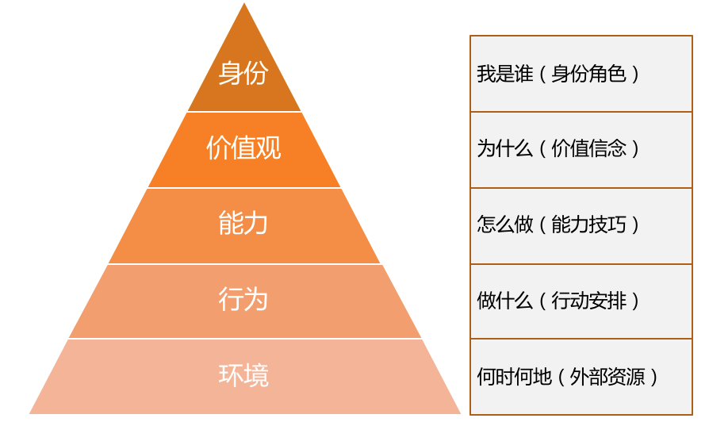


接下来，详细探讨一下，从一名职业工程师，到一名职业的管理者，在角色上都有哪些东西发生了转变。

为了让角色转变更加生动，我们还是以"马车模型"来讲解。
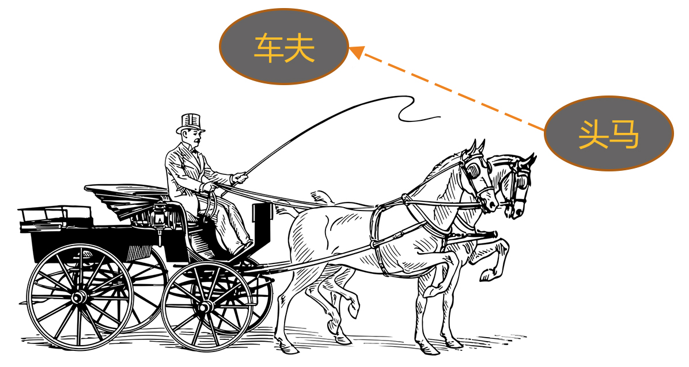

当你是一名出色的工程师时，就好像马队里的"头马"，显然你是团队里最给力的人，也是你的上级最倚重的人；
而当你称为这个团队的管理者，你就实现了一次蜕变，从"头马"转变为"车夫"，这个角色的转变对你来说意味着什么呢？

我们从是个角度来探讨一下：  
第一个角度，从工作职责看。
作为"头马"时，你的核心职责就是"拉好车"，其他事情都是次要的；而成为"车夫"后，虽然你依然可以去帮你的马队拉车，但你的核心职责却是"赶好车"，
即如何确保这辆马车良好地行驶在正确的方向上，才是最需要你关心的。

对应到工作中就是，你做工程师时，完成好上级安排给你的工作就是诸事大吉；而作为一个管理者，你要做的是带领团队往前走，上级只是帮你设定一个目标，
剩下做什么、怎么做，都是你要考虑的，所有对达成目标有帮助的工作都是份内的。这就是"赶车"和"拉车"的不同。

第二个角度，从负责对象来看，即，你需要对谁负责。
作为一名工程师，用他们的话说，"管好自己就行了"，所以主要是对自己和自己的工作负责。而作为一名管理者，由于团队是上级和公司给你的资源，
你需要对上级负责，你还得关心团队成员的发展和成长，对下级负责。

所以一个同学幽默的说：做工程师是"一个人吃饱全家不饿"，做管理就是"上有老下有小"。更高职位意味着更多的责任。

第三个角度，从关注焦点来看，也就是什么对你来说是最关注的。
工程师一般是过程导向的，因为他们需要一步一步把工作执行到位，眼睛盯着的常常是"脚下的路"；而管理者是目标和结果导向的，
他们时时关心目标和前进方向，盯着"远方的目标"，因为他们得决定要带着团队去哪里。

第四个角度，从工作内容和能力要求来看。
工程师属于个人贡献者，也就是HR口中说的IC（Individual Contributor），是靠个人专业能力来产生业绩的，工作内容以发挥专业能力为主，相对比较单一；
而管理者要做成一项工作，除了技术判断力，还需要目标管理的能力、团队规划能力、项目管理能力、沟通协调能力、团队建设能力等等，需要看方向的、带人的、做事的更加多维和立体的能力。

第五个角度，从任务来源来看。
工程师的工作任务来源，主要是上级安排，听上级指挥；而管理者的工作内容，虽然也有上级工作的拆解和安排，但更多是靠自己筹划，然后和上级去沟通确认，
从被动"等活儿"变为主动规划。

第六个角度，从实施手段来看。
大部分工程师的工作还是亲力亲为的，因为工程师角色是个人贡献者角色，所以主要靠自己完成；而管理者的工作清单涵盖了整体团队的工作，
靠自己一个人是无论如何都做不完的，因此主要是依靠团队来完成。

第七个角度，从合作纬度来看。
工程师主要的合作内容就是和评级的伙伴共同做好执行，因此主要以平级合作为主。而作为管理者，合作的内容非常丰富，比如，需要和上级合作规划好整个团队的目标，
和下级合作好落地执行，和平级管理者合作完成联合项目，有时候还需要和平级的上、下级去一起协调资源和进度。所以合作的纬度变得非常立体。

第八个角度，从和团队成员的合作关系来看。
做工程师的时候，和大家都是平等竞合关系，以合作为主，也有"竞"的成分。

我们通常爱把"竞"和"争"连在一起说，但"竞"和"争"还是不同的。"争"意味着大家拼抢同一个东西，我得到的多就意味着你得到的少，此消彼长，
比如：摔跤、乒乓球、下起都是典型的"争"。而"竞"是朝同一方向做比较的，比如：百米赛跑、跳高、跳远等田径比赛是典型的"竞"。

在之前平级的时候，你和其他同事虽然不会有"争"，但是有"竞"但成分在。而当你成为大家的上级，作为管理者来带领这个团队的时候，你和大家反而形成了全面合作的关系，
"竞"的因素不存在了。因为"竞"和"争"都是发生在同一个层次上的，要在同一个场地和同一个起跑线上，才有所谓的"竞争"。
而随着你的晋升，你和之前的同事已经不在同一个层面上工作了，也就不存在"竞"的关系了，而是彼此间荣辱与共、休戚与共、成败与共的全面合作关系。

这一点新经理一定要认识到。我之所以特别强调这个观点，是因为很多新经理成为之前同事的上级之后，和大家相处有心里障碍，不太好意思指挥和安排他们工作，
用他们的话说，"毕竟之前都是平级"。我想告诉你的是，你们的关系其实比之前更好相处了，前提是你得认识到这一点。

第九个角度，从思维方式来看。
做工程师的时候，大部分工作内容和工作要求都是执行，所以是明显的"执行思维"，特点是关注过程和细节，更重要的是关注风险和成本，
希望通过对风险的排除和成本的掌控，来保证工作交付的确定性。

所以技术出身的人往往在项目执行，尤其是过程控制管理方面，有明显的优势，他们天然就认为这不是什么难事。
当然，他们估算排期一般也会比较保守，因为他们需要确保能完成才愿意答应。

而作为管理者，虽然也考虑风险和成本，但是更习惯去关注做一件事能带来的可能性收益，并以此来判断是否值得投入资源去做，我们把这种叫"规划思维"。

由于管理者总是在盘算和筹划一些可能对公司和团队有价值的事情，而没有仔细考虑风险和成本，所以在工程师眼中，管理者时不时会提出一些"不靠谱"的期望和需求，
但这正是两个角色关注东西不同造成的。而这恰恰是一种很好的合作与互补：赶车的看方向选路径，而拉车的排除各种风险和困难，把车拉向前方。

第十个角度，从技术视角来看，即两个角色如何看待技术。
做工程师的时候，技术是用来做事情的，掌握好技术的目的就是为了做好实施，看待技术是从如何运用的角度出发。
而对于管理者来说，技术是达成目标的手段之一，所以看待技术是从如何评估的角度出发，评估该项技术是否是最合理的手段，以及如何选择才合理，并据此做出决策，
因此常常被称为技术判断力。我们的老领导经常告诫我们，即使做了管理者，技术判断力不能丢，就是指这种能力。


至此，从是个角度阐述了从一名工程师到一名管理者，角色上所发生的各种变化，但这显然并不是全部，你可以根据你自己的经验，以及在管理工作中的体会和思考，
不断丰富你对管理者这个角色的认知和理解。
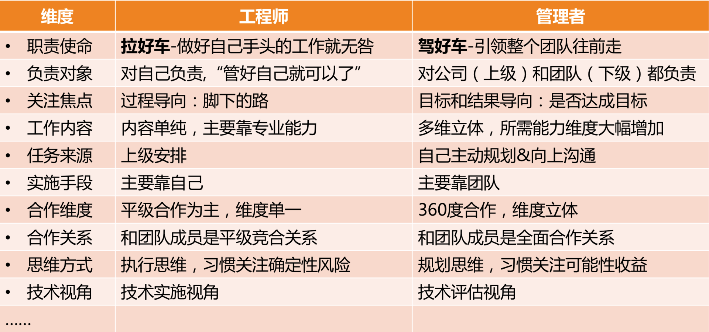

事实上，角色认知的改变，并不是一蹴而就的，需要你不断自我察觉和有意识的纠偏。也正是它足够基础和稳定，才会成为价值观、能力和行为这些层次的源头。

所以，之所以提升大家的管理认知，因为他们非常清楚，很多事情没做好，很多行为不职业，根源是认知还没有转变过来。


## 10.新经理常踩的坑儿有哪些？
上一节，我们系统的介绍了从一位工程师到一位管理者所需要做的角色转换。事实上，管理更多的是一门实践学科，从"知道"到"做到"，还需要长期的刻意学习。

新经理最常见的管理误区，汇总为六个大类，帮你未雨绸缪：  
第一类：过程导向、被动执行
常见的说法和做法：
1. 不主动找活干，总是等待上级派活儿，如果上级没有明确安排，就"放羊"。
2. 即使上级有了安排，还总是指望上级替他做决定该怎么做，选哪个方案。
3. 在和上级、下级沟通中，他主要充当"传话筒"的角色，并没有反思每次沟通要达到的目的和效果是什么？
4. 过于关注苦劳和付出。

类似的问题还有很多。我们从"马车模型"来看，这类问题但共同原因在于：这位管理者还处在"拉车"，而没有站在"马车夫"的位置去驾驶马车；
没有对整个团队的ownership，工作比较被动，关注执行过程。所以把这类问题归纳为：过程导向、被动执行。

由于没有从管理者的视角出发，所以至少会带来三个结果：
1. 团队方向感缺失。大家都只是着眼于手头工作，团队得不到愿景的凝聚和激励。
2. 团队做不出有效的业绩。因为团队没有方向感，所以结果就很难有效。
3. 无法带领一个团队。由于视角局限，所以还不具备带领团队的能力。

  
第二类：大包大揽、唯我最强  
常见的说法和做法：
1. 某某做的太慢了，还是我来做吧，他半天功夫，我两个小时就搞定了。 
2. 团队离了我就不转了，里里外外都靠我操心，他们都担不起这个责任。
3. 某某工作主要靠我...；在我的指导下，某某才...；这件事主要是我做的...

上述三个问题，我分别用三个词形容状况：
1. 问题1，叫"包工作"。也就是说，他作为一个管理者，把团队成员力所能及的工作都做了。
2. 问题2，叫"包责任"。也就是说，他作为团队负责人，把团队成员每个人应该自己承担的责任，都包在他一个人身上了。
3. 问题3，叫"包功劳"。也就是说，为了体现自己能干，处处凸显自己的功劳，把团队成员业绩和工作成果都放在自己头上。
我们把这类问题归纳为：大包大揽、唯我最强

大包大揽的管理者会带来如下的后果：
1. 梯队问题，大树底下寸草不生，梯队迟迟培养不起来。因为梯队的培养需要授权，需要让高潜人才有发挥空间并承担相应的责任。
2. 激励问题，由于管理者冲得太靠前，团队成员积极性受挫，遇事退缩。
3. 个人发展问题，由于得不到团队成员有效的支持，自己又忙又累，做不了更大的业务。
所以，成熟的公司就规定，如果你没有培养出可以完全顶替你位置的人，你是得不到晋升的。


第三类：带头大哥、当家保姆  
常见的说法和做法：
1. 好好干，我不会亏待你的，我绝不会让跟着我的兄弟吃亏。
2. 某某可能会不高兴，可能会离职，怎么办呢？
3. 某某技术比我强，我给他打下手就行了。

上面三个问题，其实是两类管理者的表现：
第一类是"带头大哥"式的管理者，讲究的是兄弟情分，在他们心中，不但兄弟的工作是我的，兄弟的人也是我的。
这类管理者在某些情况下特别有战斗力，但是一旦情况有变，对公司的破坏性也非常大，因为他忘记了他带的团队是公司的资源，而不是自己的，所以不可能成为一个职业的管理者。

后面两个问题几乎是与第一个问题相反的一类管理者，由于团队里有资深的高级工程师，他在技术判断力方面不如这些高工，索性就给这些高工做起了"保姆"，
而忘记了自己才是这个团队的舵手和船长，因此也不是一个职业的管理者。

我们把这两类问题归纳为：带头大哥、当家保姆。

这两类管理风格会带来如下后果：
1. 不职业的管理风格和文化，这会给公司带来很大的潜在风险。
2. 团队没有方向，所以很难有正确的判断和决策。


第四类：单一视角、固化思维  
常见的说法和做法：
1. 人手不够，没人，这真做不了，要做就得招人。
2. 让团队加班的话，得给大家发加班费，不然没法提升积极性。
3. 像某某那样的人才适合做管理，我跟他太不一样了，所以不适合做管理。
4. 还有个Bug没修复，不能发布，我们一直都是这么规定的。

如果作为工程师，这些言论无伤大雅，但如果作为一个团队的管理者还这样说话，就显得单一视角、固化思维。
往往由某个要素不具备就否定所有的可能性，比如"要想做事，就得招人"、"要想提高积极性，就得发加班费"、"只有某某那样的人才能做管理"等等，思维模式非常单一。

思维模式单一，往往会造成如下后果：
1. 习惯性卡住。遇到问题和困难，很容易被卡住，到处都是绕不过去的坎。
2. 认知层次低。由于被单一性思维所支配，认知层次和考虑问题的纬度无法提升。
3. 难堪重任。由于创造性地解决问题的能力不足，难以承担具有挑战的工作。


第五类：自扫门前雪、固守边界  
常见的说法和做法：
1. 这个是测试的问题，这个是产品的问题，这个是别的部门的问题。
2. 产品经理一点逻辑都没有，没法沟通。
3. 这事不赖我们团队，是某某团队没有按时完成。
4. 我查过了，不是我们的问题，惩罚不到我们。

上面几个问题的共同点就是：自扫门前雪、固守边界

我们都知道，角色和责任的边界划分，是为了分工和合作，但由于很大大型项目有赖于多个团队一起协作完成，所以又需要有人主动站出来，去承担边界模糊的那部分职责。
作为一个员工，边界分明无可厚非，但是作为一个管理者，就需要以全局的目标为己任，才能拿到公司的业绩结果。

这类管理风格往往会带来如下后果：
1. 项目推进不畅，从而影响全局结果。
2. 自我设限，因此个人成长受阻。
3. 个人影响力无法扩展。因为目光和手脚都局限于在团队内，所以无法在更大的范围产生影响力，也就无法成为更高级的管理者。


第六类：患得患失  
常见的做法和说法：
1. 突然不写代码了，感觉吃饭的家伙没了，心里发慌。
2. 管理工作太琐碎，感觉离技术越来越远，现在特别担心个人发展。
3. 做管理最大的挑战是，要舍弃技术，特别难。
4. 管理是个矛盾的事情，自己技术专业性越来越差，却要带领整个团队。

这类问题的核心原因是把管理摆在了和技术对立的位置，同时由于管理能力还没有强大到可以作为自己的核心竞争力，因此忧虑自己的技术会落后，从而失去生存能力。
我们把这类问题归纳为：患得患失。

这类管理风格会造成如下后果：
1. 犹豫反复，无法全力以赴去做好管理，成长缓慢。
2. 对技术的看法太狭隘，从而影响技术判断力的提升。
3. 由于误判，可能会错失一个好的发展平台。


以上这六种坑，总结下来就是：
第一类：过程导向、被动执行  
第二类：大包大揽、唯我最强  
第三类：带头大哥、当家保姆  
第四类：单一视角、固化思维  
第五类：自扫门前雪、固守边界  
第六类：患得患失  

这些"坑"都是用血泪教训换来的，希望你能在前行的道路上，能够认清楚这些"坑"，或规避，或跨越，驾驶你的"马车"一往无前。


## 11.我刚开始带团队，从哪里着手呢？
一个快速发展的行业会推着你往前走，不会等你万事俱备了才让你带团队，泛互联网就是这样一个领域。
也许你还没想过做管理，而且你的上级也并不希望你做纯粹的人力管理，但是"带团队"这个事情，却已经变的不可避免。
换句话说，你叫什么不重要，头衔也不重要，重要的是，你很快就得带着一个小团队做事了。

很多人对于做技术，那是胸有成竹、毫不含糊，但是对于带团队这事儿，却常常不知道该从哪里下手。你是否有类似如下困惑？
* 你需要接手一个新团队，而这个团队并不是你一点一点逐渐戴起来的。
* 组织调整，把两个或多个团队的人塞给你，你正在考虑怎么整合这个团队的时候。
* 季度交替，或者年度交替之际，你需要给上级做一个阶段性的管理汇报，虽然有前人的汇报模板，但是"知其然不知其所以然"，不太能抓住核心的时候。

这样的一些时刻，你是否历历在目？还记得你是如何应对的吗？很多leader就这样的情形给我出的题目常常是这样的：
* 新团队人员各种问题，各种人心惶惶，非常棘手，该怎么应对呢？
* 新接手的服务各种问题，手忙脚乱，各种不靠谱...
* 成天开会，各种业务讨论，顾不上和员工熟悉...

显然，这些问题不可避免，而且这些其实都在正常的管理工作范畴内。只是，这类困惑有一个共性的问题在于，管理者都一下子陷在问题里了，期待着解决掉这些问题之后，
事情就都好了，这是典型的**问题驱动型思维**。

大家应该知道大禹治水的故事：当洪水泛滥时，大禹之前的治理者都试图通过"堵漏"的方式来解决，效果并不好；直到大禹从之前的失败中汲取教训，采取"疏导"的方式来治理，
引导洪水流向某一个方向，大水才由此得到了有效的控制。

这个道理大家都明白，只是我们在茫然和慌乱的时候，就一时全忘了。而作为一个leader，"堵漏"的工作固然重要，但是有没有一个"全盘规划"但指引，
清不清楚把团队带往何方，这才是不同leader领导水平但差距所在。而我们今天要谈的"管理规划"，其实就是回答"把团队带往何方"的这个方向性问题。

通过理清未来的发展来理顺当前问题的带团队思路，我称之为**规划驱动型思维**。


关于团队方向的规划，具体该怎么操作呢？  
你一定还记得我们前文中提到的"马车模型"，一个类似的问题是，一辆马车交给你，在驾驶它上路之前，你先做哪件事情呢？
你可能会有很多想法，但我觉得你至少要考虑四个问题。

第一个问题，你先要看一下，这是辆什么车。  
如果你不清楚拉的是辆什么车，你就没法设定你的目的地，也不清楚该找什么马来拉，更不知道该走哪条路。
比如：
* 如果你拉的是一辆长途旅行车。你的目的地就可以设定的非常清楚和鲜明，平安、快速、舒适的把客人送到指定目的地，就是你的全部职责和使命。
你的车内是否舒适、马匹的选择是否快速、选择的路线是否安全等等都是你要考虑的。
* 如果你拉的是一辆观光旅行车。你的目的地可以很清楚，也可以不清楚，因为你这辆车的使命在路上，核心是这个过程能否让观光客满意。
此时，你的车体设计能否让乘客方便观赏路上的景色、你的马匹选择是否速度适中、以及路线的选择是否风景优美，就变成了此时你要考虑的。
* 如果你拉的是一辆送货的货车。你需要考虑的就是你的车是否满足获取要求的环境、一车次能拉多少货、以及马匹和路线的选择，以尽快到达交货地点。
要考虑的问题和长途旅行、旅游观光，显然有着巨大的差异。

弄清楚它是一个背负着什么职责和使命的团队，决定了你需要设定什么样的工作目标，并通过哪些要素来衡量你的目标；
决定了你需要什么样的人加入你的团队，以及需要多少；还决定了你选择什么样的手段，投入什么样的资源来完成工作。

这个问题如此重要，作为管理者的第一个要素，称为团队"职能"。这是管理工作的起点。


第二个问题，你得看看，你把这辆车拉到哪里去。  
只有明确了要去的目的地在哪里，才能评估需要什么样的马、多少匹，以及有哪些路线可以选择。关于"目的地在哪里"这个问题，是管理规划的第二要素，称为"目标"。

对于为什么要设定目标，很少有人会质疑，因为大家都认为设定目标是理所当然的事情。那你有没有想过，为团队设定清晰的目标，会带来哪些好处呢？
目标设定最基本的初衷就是着眼自己想要的结果，去实现资源的有效配置。除此之外，目标还有非常好的几个附加效果：
* 首先，清晰明确的目标可以凝聚团队成员的力量，让大家劲往一处使，提升团队凝聚力。
* 其次，清晰的目标还是执行力的必要要素，你可以回想团队取得的每一个执行出色的项目，目标一定是非常清晰。
* 再次，清晰的目标还能提升判断力，如果你能够对某个突发状况快速决策，你一定非常清晰你当时想要的是什么。
* 最后，清晰的目标本身就是激励，当员工很清楚自己的工作目标，方向感很清晰的时候，他们更容易进入心流状态，即，一种投入度非常高，沉浸其中、物我两忘的工作状态。

实际上，没有目标的团队很少，但是想设定清晰明确的目标，对于技术团队来说又非常困难，因为工程师的工作大部分很难量化。


第三个问题，你得盘点一下你有哪些马，它们情况如何。  
做管理的主要工作内容是"带团队"，因为所有的工作，都是靠团队来落地完成的，他们是真正"拉车"的人。
就好像马匹是马车动力之源一样，团队就是你达成团队目标和使命的发动机。

所以，盘点自己的团队，以及看看在整个"赶路"的过程中要如何升级完善自己的团队，并思考在达成目标之后你期待收获一个什么样的团队，都是必须要考虑的问题。
这就是管理规划的第三个要素，称为"团队"。


第四个问题，你选择哪条路。  
前面有了职责，有了目标，有了团队，接下来不应该就是赶路了吗？我想说，在赶路之前，你还得先看看哪些路可以走，即，你有哪些不同的选择，各自需要多少资源预算。

如果你选择崎岖的近路，可能你需要非常昂贵的马中"特种兵"，并配备高精尖的装备；而如果你选择宽阔的大路，你可能需要跑得快、耐力强的马，路上带的补给也会因为路况而有所差异。
因此，路径的不同选择，会带来资源投入的差异，从而，你向公司申请资源的类别和规模也是不同的。由于公司的预算是要提前做的，因此在马车出发前，即在规划的时候，就要算好。

特别说明，不要混淆路径选择和计划制定。这两者最大的区别在于，**路径选择主要是为了预算资源，而制定计划主要为了执行过程可控。**


综上，我们探讨了管理规划的四个要素，对应明确回答了如下四个问题：
1. 你团队是干什么的？
2. 你团队想做出什么成果？
3. 你依靠什么样的团队？
4. 你需要投入哪些资源？

你上级很关心这四个问题，当你能系统的把这些问题清晰地呈现给上级时，说明你对团队已有了很好的掌控力，并且还会让上级觉得，这辆车，跑步偏！
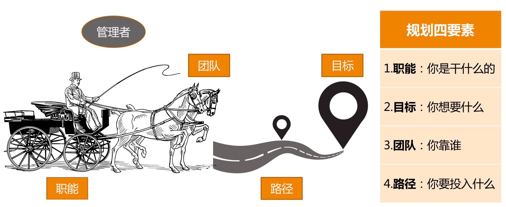

综上所述，所谓管理规划，其实就是要管理者说明白一个问题，即，你想要什么目标，以及你需要投入什么资源。由于目标取决于团队的职能，而团队又是管理者的核心资源。
所以，一份合格的规划报告，至少需要体现在职能、目标、团队、路径这四个要素。

值得说明的是，这四个要素并不是彼此孤立和静止的，而是相互关联、动态平衡的。其中最稳定的要素是职能，它是管理的起点。
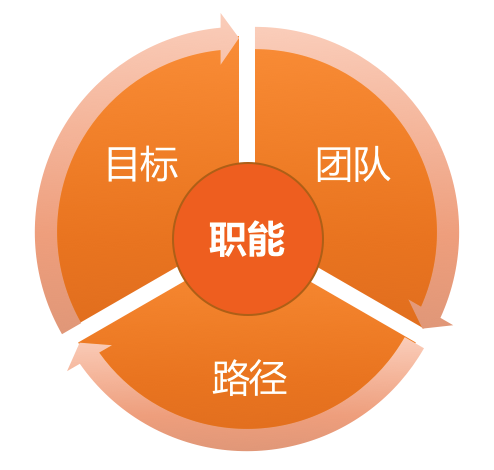


## 12.如何界定我们团队是干什么的呢？
上一文章中，我们把管理规划拆解为四个核心要素着手操作，分别是：
* 职能，关于团队是干什么的。
* 目标，关于要带团队去哪里。
* 团队，关于依靠谁去达成目标。
* 路径，关于走哪条路以及投入哪些资源。

如何明确界定一个团队的职能？很多人并不认为这个问题有多难，觉得自己很清楚自己团队的职能。
但事实上，真正用心思考自己团队但职能，并用简洁凝练的几个词或一句话提炼出来的管理者是少数。

要判断自己是否真的清楚团队职能，你可以尝试问一下自己这三个问题：
1. 公司为什么要给我这批资源（指这个团队）？是希望我产出什么？
2. 这个团队存在的独特价值是什么？
3. 你用什么纬度来衡量团队的价值高低？

如果你能毫不迟疑的做出回答，说明你很清楚自己团队的职能。如果你表现如此，那你可以用简洁的语言来陈述它吗？
如果你的答案依然是肯定的，那你团队的成员也都能准确无误的说出来吗？

我想告诉你的是，只有连你团队成员都非常清楚团队职能定位时，才能收到如下效果：
1. 大家都知道自己是做什么的，同时，知道做什么对于团队来说非常重要。
2. 大家都容易去主动思考，要提升哪方便的能力，对团队来说是最有帮助的。
3. 大家更容易理解自己工作的价值和意义，从而增强对团队的认同度和归属感。

所以，清晰的职能定位以及对职能的充分沟通，可以提升团队凝聚力、员工归属感和员工自驱力，在当今时代，这是多么重要的管理要素啊！

如何明确团队的职能定位呢？  
首先，介绍一下团队职能的两个层次：基本的职责 和 升华的使命。  
* **职责，是团队职能的下限，即，至少要完成的工作，如果这些职责都搞不定，意味着团队的基本价值都不能体现。** 一般来说，团队的基本职责，是由上级给定的，
上级在把这个团队交给你的时候，已经给你提供了期待，只不过有的上级会明确交代，而有的上级默认你很清楚。所以，无论如何都需要弄清楚团队的基本职责，否则肯定会失职。  
* **使命，是团队职能的上限，即，如果我们团队做的好，就能承担更大的职责，体现出更大的价值。** 使命达成后的愿景，常常是令人期待和憧憬的。
如果说基本职责通常是上级给定的，那么使命愿景则常常是团队leader自己规划和设想。上级一般不会作出这样的要求，最多就是提一下期待，团队做不到也不会认为是团队失职。
但是，如果团队做到了，就会非常亮眼的成绩，团队成员也会受到很大的激励和鼓舞，管理者的领导力也必定不俗。

**基本职责解决的是"团队生存"问题，而使命解决的是"团队幸福"问题。** 对于有的人来说，看不到幸福的希望，则生存也将失去意义。

我们探讨一下，设定团队职责和使命的方法和步骤：  
第一步，收集信息。可以从如下四个角度来梳理职能信息：
1. 向上沟通。听听上级对你团队的期待和要求，以及希望用什么纬度来衡量你做的好还是不好。这个信息非常重要，团队的初始定位和基本职责，一般都是上级直接给定的。
2. 向下沟通。主要是和大家探讨对团队业务的看法和理解，以及对未来发展的期待，为以后的沟通做好铺垫。
3. 左看右看。主要是看职能定位的边界在哪里，最好和兄弟团队的职能是无缝对接的。但不要覆盖兄弟部门的职责，否则会带来各种合作上的冲突。
其实，快速发展的公司，要做的失去非常多，海阔天空，即便是广度不够，深度也还有作为空间，真没必要和兄弟团队争抢地盘。
4. 你的理解。即，你对业务的理解，你对领域的理解，你对团队的期待，以及你对自己的期待。团队的更高职责，即，团队使命和愿景，往往来自于你的设想。

第二步，提炼和升华。团队的职责和使命不能只停留在leader脑海中，为了方便记忆和传播，必须从上述信息中提炼和升华。提炼和升华有三个要点：
1. 职责的提炼。基于上级的期待和要求，以及你对业务核心价值的理解，最好用上级和团队成员、兄弟部门都易于理解的语言，对职责进行简短化提炼，并尽可能长时间稳定下来。
2. 使命的升华。基于基本职责，寻找团队对于部门和公司的独特价值，并和行业发展趋势结合，设定自己的期待。要注意使用基于"结果"的描述，而非"过程"的描述。
比如保证项目交付质量，是对结果的描述；而负责项目测试，则是对过程的描述。相比之下，基于结果的描述会更有使命感。
3. 确定衡量纬度。一般来说，团队的职责和使命决定了衡量的纬度，但是如果有明确的关于衡量纬度的说法，会让员工对职责和使命有更深刻的理解。
常见的案例有：服务端团队，会特别重视性能、稳定性、扩展性等纬度；而前端团队，往往重视开发效率、兼容性、安全性等纬度；数据团队关注数据准确性、完整性、及时性、安全性等纬度。
你需要根据自己团队的职能，向员工明确传递，什么指标纬度对团队是最重要的。

第三步，确认和主张。确认主要是和自己上级确认，得到上级的认同和支持后，就可以向团队内外进行主张了。
当然，最好是在合适的场合，比如季度会、合作沟通会等，有计划、有步骤的把团队的职责和使命宣灌给大家。


## 13.如何为团队设定合理的目标呢？
管理规划有四个相互关联的要素：职能、目标、团队和路径。  
上一篇文章中，我们已经探讨了第一个要素，也就是如何界定团队职能。我想你现在应该清楚自己团队应该承担什么样的基本职责，以及希望背负什么样的使命了。
接下来一个问题就是，未来一段时间里，你希望带着你的团队抵达一个什么样的目的地呢？这就是我们所说的"目标"。

目标是一个大话题，本章主要会带你给三点：
第一，你会更清楚目标都意味着什么，它可不是让团队有事儿干那么简单。
第二，你会掌握目标设定的要点，即使你之前没做过目标管理，你也可以实际操作了。
第三，一起探讨在团队频繁调整，公司战略都不稳定的情况下，如何管理团队目标。

如果我问你，目标重不重要？你可能会不假思索的回答重要！Why？为什么目标会那么重要？目标对团队管理到底都意味着什么？  
第一，最基本的，目标包含着你和上级的诉求，即，你们希望收获的东西。  
第二，目标意味着资源的有效配置。
明确的目标可以让你把资源投注在有效的方向上，从"该做什么"去调配资源，而不是"能干什么"。  
第三，目标意味着执行力。
很多管理者都把执行力和目标分开来谈，其实技术管理者在任务执行上都是很强的，并不是短板；而表现出"执行力不够"的最大原因，都在于目标的不清晰或多变。
显然，清晰的目标是高效执行的必要条件。  
第四，目标意味着凝聚力。
明确的团队目标和愿景，就是提升团队凝聚力的重要手段之一。
大家因为相同的目标而并肩作战，在一起取得成就的过程中建立起深厚的"革命友谊"，这对凝聚力有莫大帮助。  
第五，目标意味着激励。
在提升员工自驱力的要素中，员工在工作中产生沉浸其中、物我两忘的"心流"状态，就需要有清晰的目标为前提。
而且，团队目标感带给员工对工作的意义感和使命感，也是提升自驱力的重要来源。


你看目标有这么多的效应，但并不是随便一个目标就有这样的效果，只有合理的目标才有效。那什么样的目标才是合理的目标呢？
你可能听过"**踮起脚尖能够到的目标才合适**" 。

这就涉及到目标设定原则，即"SMART"原则，
分别对应：Specific（明确性）、Measurable（可衡量性）、Attainable（可达性）、Relevant（相关性）、Time-bound（时限性）。

前面提到的"踮起脚或跳一跳能够到的目标"，只是强调了其中的可达性原则，即，不能定一个完全实现不了的很高的目标，也不能定一个不需要努力就能实现的很低的目标。
作为团队负责人，你会不会认为，定一个肯定能实现的相对保守的目标，对于向上级交差非常有利？

如果你真这么想，那你就忽略了关于目标的一个重要的原则：**目标是设定给团队的，而不是设定给上级的，其目的是为了让团队集中资源做出有效的成绩。**
当你为了容易交差而给团队设定一个没有挑战的目标时，团队成员是得不到激励的，也无法让员工进入"心流"状态。
另外，如果你总让员工做没有挑战的工作，他很可能会因为没有成长而跟你提离职。所以，一个有挑战且努力能达到的目标，才是恰当的。

上面说的是可达性原则，接下来讨论目标的明确性和可衡量性，我认为这两个原则是分不开的。

目标要明确，那究竟什么叫"明确"呢？我觉得你可以简单的理解为，把目标设定到可以衡量的程度，就叫做明确了。例如：  
第一组：  
a. 我们的目标是提升某个服务的性能。  
b. 我们的目标是把某个服务的性能从300qps提升到500qps。  
第二组：  
a. 我们的目标是发布BI系统1.0。  
b. 我们的目标是发布BI系统1.0，支持KPI数据统计、全量数据导出功能。  
至此，想必你应该就清楚目标的明确性和可衡量性该如何操作了吧。

关于目标相关性原则，对于技术团队来说很难跑偏，因为技术这个角色决定了其工作内容必须是和上、下游及上级目标相关联的。

关于目标时限性原则，所有的目标都是基于一定时限的，缺少实践限制的目标没有意义。比如前面提到的"提升单机性能"的目标或"发布BI系统1.0"的目标，
如果没有限定一个时间，就不清楚什么时候去衡量，也就无所谓是否有挑战和是否完成。所以，一定要有个明确的时间点，比如"到9月底，把单机性能从300qps提升到500qps"，
"到12月底，发布BI系统1.0，支持KPI数据统计、全量数据导出分析功能"，就是两个完整且合理的目标描述了。

所以，当你要评判一个目标是否合理时，需要从SMART这五个原则去逐个审视，如果都符合了，说明你这个目标是清晰可行的。

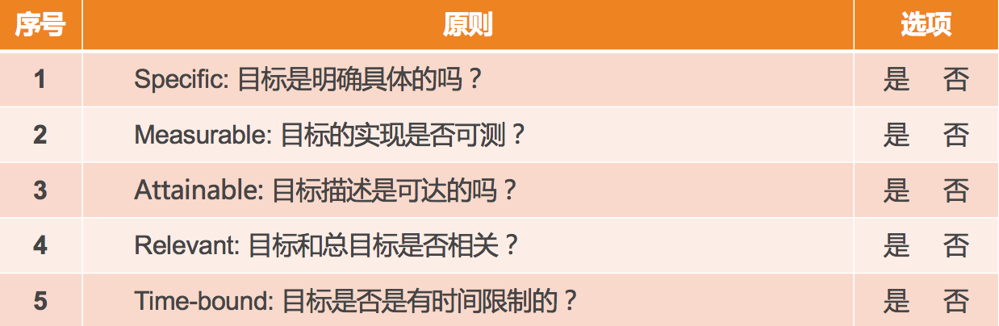


目标的描述一般长什么样子？目标的描述形式，一般分为两大类：  
一类是可以量化的指标，就是大家常说的KPI(Key Performance Indicator，关键绩效指标)；  
一类是不可量化的指标，用关键结果来衡量，就是我们常说的KRA(Key Result Areas) 或 OKR(Objectives & Key Results)

它们大体上的描述形式是：  
* KPI，到某时间点，什么指标达到什么数字。
* KRA/OKR，到某时间点，完成什么工作，该工作实现来哪些功能或达到了哪些效果。

看起来，制定这样一个目标挺简单，但事实上，新经理在目标设定上，常常会踩一些坑，面临诸多挑战。如下四类问题和挑战是最常见的：  
第一类问题，基于现有资源做目标，而不是基于远方的目标往前推。
这类常见说法是："我们团队只能做到这个程度"、"这些项目能做完不错了"等。
其实，更为合理的做法应该是，**从上级的角度来讲，你的团队需要保证哪几项重要的结果，然后再看如何调配和补充资源。**
面对这类问题和挑战的钥匙叫做"**以终为始的出发点**"。

第二类问题，目标不明确。你可能会说，"从上面你说的来看，一个明确的目标很容易制定。"，但问题在于新管理者很少会因为"目标笼统或太大"导致不明确；
不过，倒是常常会因为"过程化描述"而引发目标不明确的情况出现。
常见的说法有："我们要在10月底，完成架构改造"、"我们要在12月底，上线反作弊系统1.0"等等。
这类描述问题在于，主要强调"我做了什么"，而没有交代做完这些工作后，"取得了什么效果"。
因此，面对这类问题和挑战的钥匙叫做"**结果导向的描述**"。

第三类问题，目标设定好之后，自己和自己的上级很清楚了，但是没有刻意地向团队成员来传达，只是按照目标拆解去安排大家的工作。
这样的做法，导致团队成员对于整个团队的方向感不清晰，那么前面我提到的哪些目标能带来的效果就无法显现。比如，起不到对团队凝聚力和激励的效果。
面对这类问题和挑战的钥匙叫做"**目标的向下同步**"。

第四类问题，目标总是被迫变来变去。互联网领域很少有非常稳定的公司，业务总是在调整，自己的上级也时不时就换个新的，甚至于公司的战略也每隔一段时间就变一次。
显然，之前为团队设定的目标，也得跟着变来变去。于是，目标慢慢变得形同虚设。
面对这类问题和挑战的钥匙叫做"**设定专业目标**"，用专业目标增强团队的内在定力。

团队和人是一样的，如果总是被外在需求牵着走，内心必然会充满焦虑，所以还需要弄清楚自己的内在追求。而专业目标，就是为团队树立明确的内在追求。


## 14.如何来规划团队的组织结构呢？
管理规划的四个核心要素：职能、目标、团队和路径。前面我们探讨了职能和目标，你应该很清楚自己团队的基本职责和使命了，并且已经为团队设定了清晰的目标。
接下来，我们谈一谈如何做团队规划。

围绕着"团队"的工作非常多，现在我们只探讨团队规划，主要从如下三个视角：
* 第一个视角是看团队目标
* 第二个视角是看资源
* 第三个视角是看人才培养

**团队规划第一视角，是根据团队目标的设定去树立团队。**  
在上一篇文章中，我们对"目标"的探讨主要聚焦于"业务目标"，那么本文我们探讨的团队规划，则包含了对"团队目标"的设定。
这里的"团队目标"，不是指团队所要完成的业务目标，而是你希望在某个时间点到来的时候，把团队发展成什么状态。

对于某个人"长什么样子"的话题，你可能会从皮肤、样貌、身高、体重等要素来衡量。那么对于一个团队长什么样子，你需要用什么指标来衡量呢？通常来说是如下三个：  

首先，是团队的规模。也就是你的团队有多少人，这其中要理清楚有多少人是现有的，有多少人是接下来要新增的，即实际人数和预算人数，加起来就是你规划的团队总规模。

其次，是团队分工。即，你的团队都负责哪些业务，每个业务配置了多少人力，以及这些人员都如何分工，人力分布和业务目标是否匹配等。

最后，是团队的梯队。一个团队的梯队情况代表了团队的成熟度和复原力。梯队成熟的团队，不会因为一些偶然的因素就随便垮掉。复原力强的团队只是短暂影响部分业务进展，
但是不会伤筋动骨、元气大伤，很快就恢复正常。这个复原力很像技术服务但健壮性，会让团队非常有韧劲，经得起折腾。

综上，如果你从规模、分工、梯队三个要素来描述你团队的情况，就能看清团队的"样貌"了。


**团队规划第二视角，是从资源角度来审视团队。**  
从资源的视角来看待团队，是一个成熟管理者的标志之一。因为站在公司角度来看，每个团队都是一批人力资源，所以有个专门的职能角色叫HR（人力资源）。

现在在很多互联网公司，技术团队往往是最昂贵的资源和成本，预算人力，实质上就是预算资源。所以，作为一个管理者，在盘点自己当前人力和预算人力的时候，
需要有成本意识，要考虑投入这么多资源和成本是否值得，是否合理。其实，即使你不考虑这个问题，你的上级也会考虑，所以，你预算人力的时候，最好能给出十分充分的理由：
为什么你需要这些人？为什么是这么多？你的依据和估算逻辑是什么？当然，你并不需要把所有的推演过程都报告给上级，但是这并不意味着你不需要一个令人信服的推演逻辑，
毕竟光靠"拍脑袋"肯定是不行的。

那么怎样才能够合理推算呢？  
1. 取决于你对业务的理解，以及你希望达成的目标。毕竟需要投入的人力和目标是息息相关的，和手段的选择也是密切相关的，换句话说你的各项决策都影响着资源的估算。
2. 可以参照行业资源配比情况。比如行业里产品、设计、开发、测试、运维等不同角色都有大体的比例，虽然不可照搬，但可用于参照，尤其是业务类型相似的。


**管队规划第三视角，是从人才培养角度来看梯队规划。**  
对于团队的盘点，除了团队的发展目标和资源投入视角，还需要从人才培养角度来看。即，到下一个时间节点，你需要重点培养出哪些人，给他们什么样的平台和空间，
以及你有能力提供给他们什么指导和支持，期待他们能够胜任什么职能和角色。

一般来说，你重点培养的都是你团队最核心的人，也包括最优潜质的人，但是一般只设计你的直接下级和他们的个别下级这两层，其他层次的人才培养则是你下级管理者的职责。
当然，对于新经理来说，只需要关心自己的直接下级就可以了。

关于新人的培养和引进，这里提出一个新概念叫"团队消化能力"。鉴于团队现实的梯队情况和新人导师的精力问题，一个团队能够良性吸纳的新人是有限的；
如果新人引进过快，就会快速冲淡当前的团队状态，就和新组建一个团队差别不大了，这时很多新经理会顾此失彼，团队也近乎失控。所以，这主要看你的取舍。
有的管理者倾向于有步骤、有节奏的发展，而有的管理者迫于业务压力，也就不考虑团队消化能力了。这些做法无所谓谁对谁错，只是因人而异罢了。
但是，无论做哪种选择，考虑你的团队消化多少新人，是你做团队规划时需要关注的一个问题。

那么如何估算团队消化能力呢？  
1. 不可否认，带新人是需要花费老员工一些时间和精力的。所以要看看你团队都有谁能带人，分别带几个比较合理。所谓合理，就是需要兼顾他们对业务的投入。
2. 看看你团队的新人培养机制是否成熟健全。如果你团队有成熟的新人入职培养机制和熟悉业务的学习资料，那么能同时消化的新人就会多一些。
所以，作为一个"踏实"的管理者，把这些基础管理工作做起来，对于团队的长线发展是很有好处的。即便你的直接上级是个"急功近利"的老板，你也可以有自己的管理风格。


上面从三个视角探讨了团队规划的逻辑和要点，那么，如果真的要给上级提交一份规划报告，关于团队部分，你应该以什么形式来呈现呢？
我建议你要以和上级约定俗成的习惯和形式来呈现。假如你们还没有明确的要求和约定，那么你可以参照下面的形式，大体上也是三个部分：  

第一个部分，绘制一张组织结构图。这张图需要体现我们提到的团队状态三要素：
* 规模，包括当前人数、预算人数、总人数。
* 分工，体现团队人力都分布在哪些业务上，以及各个业务都由谁来负责。
* 梯队，包括团队的级别和梯队分布情况。
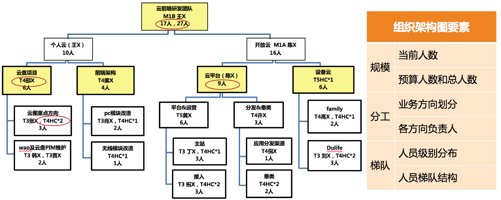

第二个部分，列出整个团队资源盘点情况。大体情况如下：  
* A级别：x人，其中当前m人，预算新增n人
* B级别：y人，其中当前m人，预算新增n人
* C级别：z人，其中当然m人，预算新增n人
* ... ...

第三个部分，列出重点培养对象，以及负责业务。大体如下：  
* 张三，xx业务核心工程师，到年底完成负责xx业务，并能带新人
* 李四，yy业务负责人，到年底能带n人独立负责yy业务
* ... ...

综上，团队的规划呈现很简单吧。所以，核心还是对规划要点的思考和梳理。


## 15.我都要申请哪些资源呢？
做管理规划，无论你是想评估团队的投入产出，还是给上级做工作汇报，都有一个必要的内容，就是要弄清楚，你需要投入多少的资源。
而投入多少资源，除了和希望达成的目标相互匹配，还和你选择什么样的路径和手段息息相关。

接下来，我们集中探讨一下管理规划的第四个要素：路径选择和资源申请的问题。

可能一线管理者会说，我需要考虑资源类型非常单一，基本上每次申请资源都是增加人力，这有什么难的。我想说，增加人手没有问题，只是在采用"增加人手"这个方案之前，
你是否考虑到如下三个问题了呢？  

第一个问题，你是否了解资源的丰富性呢？  
一提到资源申请，人们大多数会想到的是人、财、物这三大项。对于做技术团队管理的你来说，"人"是最常见的资源。而且，"财"和"物"的预算一般也围绕着团队人数来做。
比如，团建费用、培训费用、差旅费用、办公设备等等，都是基于团队人数来预算的，整体上并不复杂。

但这里我还需要提醒你的是，还有其他几类资源也需要关注，可不要忽略。

首先，是时间。很多管理者会忽略时间这个最重要的资源。对于任何一项工作，你预算多少人和你预算多少时间是分不开的。
所以，做规划的时候，也需要了解上级对各项工作的时间预期是什么样子的。这意味着，上级允许你花多少时间来做这些工作。
千万别认为，上级批准了你的人力预算就等于给了你充足的资源，因为还得看看上级给了你多少时间。而且，上级固然有上级的期待，但你还是得有自己的判断，
因为，你最清楚各项工作的具体情况，需要综合你对紧急重要程度的理解做出判断。所以，请把时间当作资源来看待，这样你会更加清楚对于投入的理解。

其次，是信息。信息资源，是另外一个常被忽略的资源。有的时候，你需要更多的公司内外的信息，可能是业务的，也可能是人员的；你的工作如果需要特殊的信息和数据，
需要提前和上级沟通，寻求必要的支持。

最后，是权限。和信息资源类似，也是处于做好某项工作的目的，你可以看看需要开通哪些之前不具备的权限，以及这些权限是否可获得。
比如，有的公司一线管理者是有哦沟通绩效权限的，而有的公司则不允许。如果你要把绩效作为重要的人才培养和激励手段的话，就得考虑你能否获取这样的权限。

所以，你看除了人、财、物，你还需要很多资源的支持，所以当你评估一个平台是否有发挥空间时，可不只看职位的高低，人员多寡。
你能否得到全方位的支持，也是很重要的因素。当然，前提是你知道自己需要什么。


第二个问题，你是否意识到手段的多样性？  
工程师出身的管理者，"炫技"的情况比较常见，其中一个显著的特征就是，只有自己开发的作品才是最好的，一有机会就重构，因为，"之前写的东西是在太烂来，不能忍受"，
崇尚亲力亲为，凡事自己开发。所以，一旦有大的新需求，用他们的话说，那得"招聘一些工程师才能做"。

站在工程师的视角上，追求工作的极致品质，恰恰是一种良好的工匠精神。但是站在管理者角度上，就需要评估一段时间内产出效率了。
衡量一项工作"到底需要花5天做到70分，还是10天做到90分"，是管理者的日常工作。90分方案未必就比70分方案好，此时，就需要优秀的工程师出身的你放弃一些执念了。
一旦放松了这个念头，你就会发现，完成一项工作，原来还有很多的手段可以选择。

比如你想做一个新功能，诸如"人脸识别"、"自动推荐"、"反作弊"等。以下做法是不同管理者采用过的：  
1. 自学自研
2. 招聘专业级人才
3. 借调工程师
4. 跨部门合作
5. 请外包或者外部专业人士兼职做
6. 采购云服务
7. 购买现成的解决方案


在不同的公司、不同的期待之下，不同的管理者会做出不同的选择。这不同的选择会带来不同的效果，同时也意味着不同的成本。如下：  
1. 对于自学自研来说，由于靠自己团队的力量，资金开销比较低，维护成本也可控；而由于需要边学边做，时间成本会比较高。
2. 对于招聘来说，不确定性比较高，招聘顺利固然好，但招聘不顺则时间完全不可预期，整体上时间成本比较高。
3. 对于人才借调来说，如果能借调到合适的人，各方面的成本是最低的，但是需要这个事情足够重要才能获得支持。
在中大型公司里的管理者，可以把这个作为可选路径之一，而早期公司，一般并不具备这个条件。
4. 对于跨部门合作来说，项目推进的可控性取决于合作情况，这里最大的风险就是合作成本能否控制住。
5. 对于外包来说，时间和资金成本一般都可控，用来做尝试性项目或者demo是比较合理的。但如果是长期的任务，你会发现外包的解决方案可维护性比较差，迁移和替换的成本会比较高。
6. 采购云服务，对于中小公司来说，其实是很好的解决方案，对人才成本、维护成本、时间成本，都可以降的很低，特别适合初创公司，所以你看业内云服务层出不穷，确实有价值。
7. 买方案，是时间成本很低，资金成本略高的一种方案。在应急的情况下，或者是公司非核心业务的场景下，这倒不失为一种很好的解决方案。

以上的说法和判断，是我基于我之前的团队情况给出的。那么对你来说，不同的方案意味着多大程度的成本呢？你可以尝试把你认为的"大"、"中"、"小"填入下表中。
这个表格最大的意义不在于让你去评估每一种方案的成本大小，而在于扩展你的管理思路，看到解决问题手段的多样性，避免思路过于单一，就达到目的了。
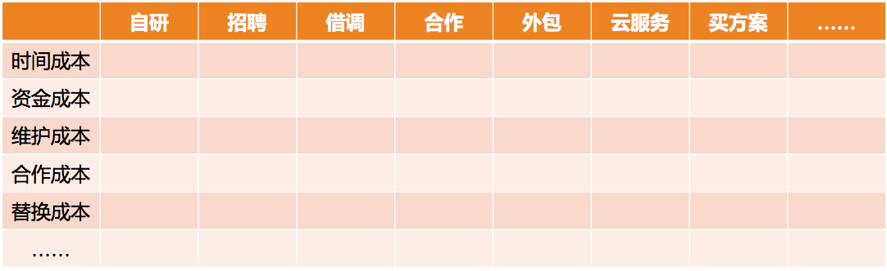


第三个问题，即人力资源的持续性。通俗说就是，不是所有的人力短缺，都要通过招聘来解决。  
在我给互联网公司做技术管理咨询的过程中，遇到不少中小型公司的技术负责人或创始人，动辄让我帮忙介绍某领域的资深专家。他们常常这么说：
* 说法1：对于我们这个业务来说，数据很重要，我需要搭个数据团队，能帮我介绍一位数据大牛吗？
可实际的情况是，自己连数据需求都描述不清楚，只是直觉上认为这能给公司带来价值，其实每天的数据量，拉个表格都能看清楚了。
* 说法2：我们接下来要做智能推荐系统，得招聘两个专门做推荐算法的。
可实际的情况是，大部分数据都是格式化数据，却连最基本的推荐策略都还没做，还远远达不到专业评级。
* 说法3：我们需要招两个做专业图像处理和模式识别的
可实际的情况是，公司业务的核心竞争力在于O2O业务，而不在于图像处理技术。

以上的这些说法，显然，他们太高估招聘能解决问题了，而且太低估人才选用育留的成本了。事实上，牛人一般会嫌业务量小、平台小招聘不来，即便来了，成天形单影只的，也未必留的住。
所以，招聘作为一种迟缓的解决问题的手段，更多地是看长线是否需要。


对于工程师思维特别重的管理者来说，他们尤其倚重技术；对于不懂技术的管理者来说，他们又哦特别迷信技术。
而职业的技术管理者，就需要在这之间找到一个平衡，提供一个既能够解决问题，成本又合理的可操作的执行方案，而不是一个"走一步，算一步"的对策。

以上的三个意识如果你都具备，能够从资源丰富性、手段多样性和人才持续性来预算你的资源，说明你已经是一位老道的管理者了。
我们通常会说，管理者要做战略，所谓战略是什么呢？**其实就是筹划把资源投在什么方向，以达成什么目标。** 所以，资源视角就是战略视角。

至此，我们探讨完了管理规划的四个要素：智能、目标、团队和路径。
细心的你也许会发现，**探讨路径以及预算资源的时候，离不开目标和团队；而盘点团队的时候，又脱不开目标和路径；而设定目标的时候，也需要基于当前团队的情况和可用资源。**
也就是说，尽管我们把目标、团队、路径分开探讨的，但是这几个要素之间并不是割裂的，而是相互联系的。
所以，只有你把这三个要素统筹起来，梳理明白，才能"产出"一份完整的管理规划。


整个"管理规划篇"其实都是围绕同一个主题展开，那就是弄清楚团队工作的方向问题。相信通过这几篇文章的探讨，你已经很清楚做一份管理规划都需要考虑哪些要素，
以及各个要素的操作要点了。
